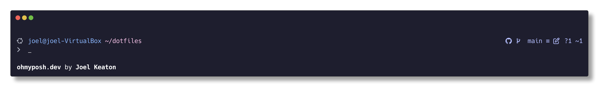

# dotfiles

My personal dotfiles. Has configurations for bash, zsh, and (WIP) NixOS.

## Setup

Install `git` and `stow`. Clone this repo, and in the root of the repo, run `stow .`.

Some setup scripts for components are in the works (namely `thefuck`). More to come.

## Extra commands (for reference)

Capture `Oh My Posh` theme:

`oh-my-posh config export image --background-color #1e1e2e --output ./theme.png --author "Joel Keaton"`

